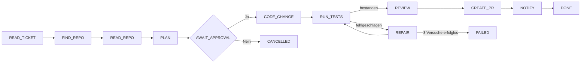
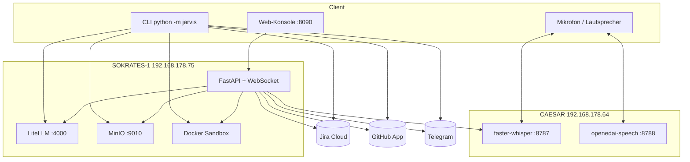

# J.A.R.V.I.S Pilot

**Autonomer Entwicklungsassistent der WAMOCON GmbH.** JARVIS liest ein Jira-Ticket, erstellt einen Plan, wartet auf die Freigabe durch einen Menschen, ändert den Code, testet ihn in einer isolierten Sandbox, lässt ihn von einem zweiten Modell prüfen und öffnet einen Draft Pull Request auf GitHub. Das Ergebnis landet als Kommentar im Jira-Ticket.

Bedienung über die Kommandozeile, per Sprache oder über eine Web-Konsole mit Live-Fortschritt.

> Status: Pilot (V0). Ein Repository, ein Jira-Projekt, lokales Netz. Kein Login, siehe [Sicherheit](#sicherheit).

---

## Inhalt

- [Was JARVIS tut](#was-jarvis-tut)
- [Grundregeln](#grundregeln)
- [Architektur](#architektur)
- [Installation](#installation)
- [Konfiguration](#konfiguration)
- [Benutzung](#benutzung)
- [Web-Konsole](#web-konsole)
- [Fehlerbehandlung](#fehlerbehandlung)
- [Deployment auf SOKRATES-1](#deployment-auf-sokrates-1)
- [Projektstruktur](#projektstruktur)
- [Sicherheit](#sicherheit)
- [Bekannte Grenzen](#bekannte-grenzen)

---

## Was JARVIS tut



| Schritt | Was passiert |
|---|---|
| READ_TICKET | Liest Titel, Beschreibung, Akzeptanzkriterien, Labels und Kommentare aus Jira |
| READ_REPO | Klont das Ziel-Repository (flach) in ein temporäres Verzeichnis |
| PLAN | Der Planer (`sokrates-fast`) erstellt Vorgehen, betroffene Dateien, Testplan und Risikoklasse |
| AWAIT_APPROVAL | Der Plan geht als Kommentar nach Jira und per Telegram an den Entwickler. JARVIS wartet auf **Ja** oder **Nein** |
| CODE_CHANGE | Der Coder (`jarvis-coder-large`) liefert einen Unified Diff, der eine Qualitätsprüfung durchläuft |
| RUN_TESTS | `pytest` läuft in einem Docker-Container ohne Netzwerk |
| REPAIR | Bei roten Tests bis zu drei Reparaturversuche mit gezieltem Fehler-Feedback |
| REVIEW | Ein unabhängiges Modell (`jarvis-review`) prüft den Diff |
| CREATE_PR | Branch `jarvis/<ticket>` pushen und Draft Pull Request öffnen |
| NOTIFY | Kommentar mit PR-Link, Testergebnis und Review im Jira-Ticket, Telegram-Nachricht |

Ein **Trockenlauf** (`--dry-run`) endet nach der Freigabe: Plan ja, Codeänderung nein.

## Grundregeln

Diese Regeln sind im Code erzwungen, nicht nur konfiguriert:

- **Keine Änderung ohne Freigabe.** Jeder Lauf wartet auf einen Menschen. Pläne mit hohem Risiko verlangen die getippte Bestätigung `yes I confirm`.
- **Nur Draft Pull Requests.** JARVIS merged nie.
- **Sandbox ohne Netzwerk.** Tests laufen mit `--network none`, begrenztem Speicher, CPU und Prozessen.
- **Nur freigegebene Dateien.** Ein Diff, der Dateien außerhalb des genehmigten Plans ändert, wird abgelehnt.
- **Scheitern ist sichtbar.** Kann JARVIS eine Aufgabe nicht lösen, endet der Lauf mit `FAILED` und Exit-Code 1, und im Ticket steht, dass ein Mensch übernehmen muss.

## Architektur



| Komponente | Aufgabe |
|---|---|
| LiteLLM | Gateway zu den Modellen `sokrates-fast` (Plan, Chat), `jarvis-coder-large` (Code), `jarvis-review` (Review) |
| Docker | Isolierte Testausführung, Image `jarvis-sandbox:latest` |
| MinIO | Ablage von Diff und Fortschrittsprotokoll je Lauf (`runs/<run-id>/`) |
| Jira | Tickets lesen, Plan und Ergebnis kommentieren |
| GitHub App | Branch pushen, Draft PR öffnen |
| Whisper / Speech | Spracheingabe und Sprachausgabe |
| Telegram | Benachrichtigung über Plan, PR und Fehler |

## Installation

Voraussetzungen: Python 3.11 oder neuer, Docker, Zugriff auf das WAMOCON-Netz.

```bash
git clone https://github.com/PrinsSayja05/jarvis-pilot.git
cd jarvis-pilot
python -m venv .venv
source .venv/bin/activate          # Windows: .venv\Scripts\activate
pip install -e .

docker build -t jarvis-sandbox:latest ./sandbox/
cp .env.example .env               # danach echte Werte eintragen
```

Für Sprachein- und -ausgabe am Rechner wird zusätzlich die PortAudio-Bibliothek benötigt (unter Linux `sudo apt install libportaudio2`). Ohne PortAudio funktioniert alles andere weiterhin.

## Konfiguration

### `.env` (Zugangsdaten, nie committen)

| Variable | Bedeutung |
|---|---|
| `JARVIS_API_KEY`, `LITELLM_BASE_URL` | Zugang zum LiteLLM-Gateway |
| `GITHUB_APP_ID`, `GITHUB_APP_PRIVATE_KEY_PATH` | GitHub App WAMOCON-JARVIS |
| `GITHUB_ORG`, `GITHUB_PILOT_REPO` | Ziel-Repository des Piloten |
| `JIRA_BASE_URL`, `JIRA_EMAIL`, `JIRA_API_TOKEN` | Jira Cloud |
| `MINIO_ENDPOINT`, `MINIO_ACCESS_KEY`, `MINIO_SECRET_KEY` | Artefakt-Ablage |
| `WHISPER_URL`, `SPEECH_URL` | Sprachdienste auf CAESAR (alte Namen `STT_URL`, `TTS_URL` gelten weiter) |
| `MIC_DEVICE` | Mikrofon als Index oder Namensteil, z. B. `1` oder `Onboard MIC` |
| `TELEGRAM_BOT_TOKEN`, `TELEGRAM_CHAT_ID` | Benachrichtigungen. `disabled` schaltet Telegram ab |

### `jarvis.yaml` (Verhalten)

Modell-Aliase, Sandbox-Befehl und Timeout, Grenzen für Reparaturversuche, Git-Branch-Präfix. `pr_draft: true` und `auto_merge: false` sind Pflicht.

## Benutzung

```bash
python -m jarvis JW-9 --dry-run      # nur planen und Plan freigeben lassen
python -m jarvis JW-9                # voller Lauf bis zum Draft PR
python -m jarvis --voice             # Ticket einsprechen, Status hören, mit "Ja"/"Nein" freigeben
python -m jarvis JW-9 --demo         # Präsentationsmodus: große Schrittanzeige, Sprache, Pausen
python -m jarvis JW-9 --auto-approve # NUR FÜR TESTS: freigeben ohne Nachfrage (nie bei hohem Risiko)
python -m jarvis console             # Web-Konsole auf http://localhost:8090
```

**Sprachmodus.** JARVIS fragt „Welches Ticket soll ich bearbeiten?“, nimmt fünf Sekunden auf und versteht zum Beispiel „Bearbeite JW fünf“ oder „WMCNL 2566“. Während der Arbeit spricht JARVIS den Status. Bei der Freigabe genügt „Ja“ oder „Nein“. Ist die Antwort unklar oder Whisper nicht erreichbar, fragt JARVIS im Terminal nach. Stille wird nie als Zustimmung gewertet.

## Web-Konsole

`python -m jarvis console` startet FastAPI mit WebSocket-Livestream auf Port 8090.

- Ticketauswahl, Trockenlauf oder voller Lauf, Freigabe per Klick
- Live-Fortschritt mit Prozentanzeige, Protokoll mit Zeitstempeln, Ergebnis mit PR-Link
- Mikrofon-Knopf: fünf Sekunden Aufnahme im Browser, das Ticket wird automatisch gewählt
- JARVIS-Chat für Fragen zu Code, Tickets und Technik
- Deutsch und Englisch umschaltbar, Verlauf der letzten Läufe, Schnellzugriff auf Jira, GitHub, LiteLLM und MinIO

Browser erlauben das Mikrofon nur über HTTPS oder `localhost`. Unter `http://192.168.178.75:8090` braucht der Mikrofon-Knopf deshalb eine HTTPS-Route.

| Endpunkt | Zweck |
|---|---|
| `GET /api/tickets?project=JW` | Offene Tickets |
| `POST /api/tickets` | Ticket anlegen |
| `POST /api/run` | Lauf starten |
| `WS /ws/{run_id}` | Live-Ereignisse eines Laufs |
| `POST /api/run/{run_id}/approval` | Plan freigeben oder ablehnen |
| `GET /api/runs` | Letzte Läufe |
| `POST /api/voice-input` | Audio (webm/wav) zu Ticketnummer |
| `POST /api/chat` | Chat mit JARVIS |

## Fehlerbehandlung

| Situation | Reaktion |
|---|---|
| Diff unbrauchbar | Bis zu drei neue Versuche mit dem Fehler als Hinweis |
| Test benutzt Funktion ohne Import | Wird vor dem Testlauf erkannt, der Coder erhält den fehlenden Import als Hinweis |
| Tests nach Reparatur weiter rot | Lauf `FAILED`, Jira-Kommentar „manual intervention needed“ |
| Review-Modell fällt aus | PR wird trotzdem erstellt, mit Warnung im PR |
| PR-Erstellung scheitert | Ein weiterer Versuch, danach Jira-Kommentar mit dem Diff als Anhang |
| Jeder `FAILED`-Lauf | Telegram: „❌ JARVIS FAILED, Ticket, Grund“ |

## Deployment auf SOKRATES-1

Die Konsole läuft als systemd-Dienst `jarvis-console` unter dem Benutzer `wamocon`.

```bash
scp console/index.html          wamocon@192.168.178.75:/home/wamocon/jarvis-console/console/
scp jarvis/console/server.py    wamocon@192.168.178.75:/home/wamocon/jarvis-console/jarvis/console/
ssh wamocon@192.168.178.75 "sudo systemctl restart jarvis-console"
```

Die Sandbox-Container laufen dort mit der UID des Dienstes, damit Testdateien nach dem Lauf aufgeräumt werden können.

## Projektstruktur

```
jarvis/
  main.py              CLI (typer): --dry-run, --voice, --demo, --auto-approve, console
  pipeline.py          Ablauf, Fallbacks, Sprachausgabe je Schritt
  state.py             Zustandsautomat und erlaubte Übergänge
  progress.py          Fortschritt, Zeitmessung, Demo-Banner
  config.py            .env und jarvis.yaml
  clients/             Jira, GitHub, LiteLLM, MinIO, Docker-Sandbox
  steps/               read_ticket, plan, approval, code_change, diff_quality,
                       run_tests, repair, review, create_pr, jira_comment,
                       notify, voice_input, voice_output
  console/server.py    FastAPI-Backend der Web-Konsole
console/index.html     Web-Oberfläche
sandbox/Dockerfile     Test-Image (python:3.12-slim + pytest)
jarvis.yaml            Modelle, Grenzen, Git-Regeln
```

## Sicherheit

- `.env` ist in `.gitignore`. Zugangsdaten gehören nur dorthin, nie in `.env.example` oder den Code.
- Die Web-Konsole nimmt nur Anfragen von ihrer eigenen Seite an (Origin-Prüfung). **Einen Login gibt es noch nicht** (WMCNL-2533): Wer im lokalen Netz die Seite öffnen kann, kann Läufe starten und freigeben.
- Modellausgaben im Chat werden vor der Anzeige maskiert und nie als HTML ausgeführt.

## Bekannte Grenzen

- Ein fest eingestelltes Ziel-Repository (`find_repo` wählt noch nicht je Ticket).
- Tickets, die neue Abhängigkeiten brauchen, scheitern, weil der Plan `pyproject.toml` nicht ändern darf.
- Telegram-Antworten „APPROVE“/„REJECT“ werden noch nicht ausgewertet. Freigabe erfolgt im Terminal, per Sprache oder in der Konsole.
- Die Spracherkennung von Ticketnummern ist bei Zahlen noch unzuverlässig. Ein falsch erkanntes Ticket fällt spätestens bei der Freigabe auf, weil JARVIS den Titel vorliest.
- Das Modell `jarvis-general` antwortet derzeit nicht. Der Chat nutzt deshalb `sokrates-fast`.

---

WAMOCON GmbH, Mergenthalerallee 79-81, 65760 Eschborn
